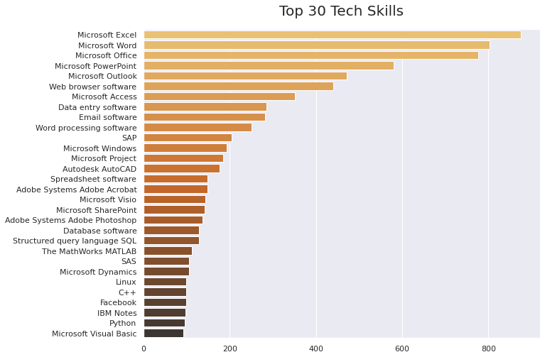
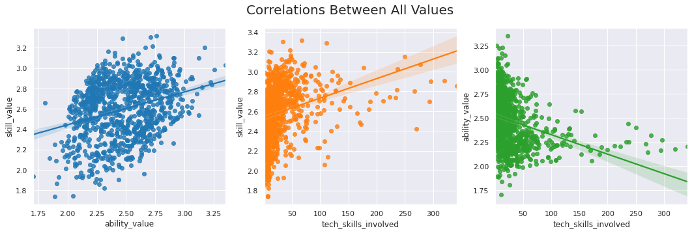
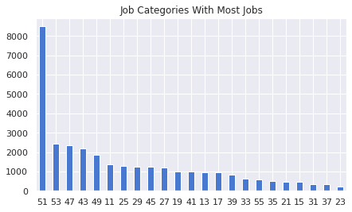

# O\*NET Analysis and Classification

## Overview 
The O\*NET Program is the United States' primary source of occupational information. Valid data is essential to understanding the rapidly changing nature of work and how it impacts the workforce and U.S. economy.

In this project, I look at abilities, skills and tech skills data from O\*NET. Specifically, I look at some of the most in-demand skills and abilities for jobs and also what jobs require high levels of both skills and abilities. I also train a classifier to predict around 500 random LinkedIn job titles and match them with SOC (Standard Occupational Classification) codes, which is how O\*NET classifies jobs.

[**Click here to view the notebook in nbviewer**](https://nbviewer.jupyter.org/github/dan-grant-hunter/ONET_Analysis_Classification/blob/main/onet_analysis_and_classification.ipynb)
 
## Summary of Findings
* Active listening, speaking and critical thinking were the top three skills that jobs most often require.

* Microsoft software such as Excel, Word, etc. makes up over a third of the top 30 tech skills that jobs require.

* Jobs which fall under Software Developers (for applications) require the most varied skill set.

## Summary Statistics of Models

|   Models |  Best TfidfVectorized Precision Score |  Best CountVectorized Precision Score |
| :- | :-: | :-: |
| Naive Bayes | 0.50 | 0.52 |
| SVC (one-vs-one) | 0.43 | 0.52 |
| LinearSVC (one-vs-rest) | 0.49 | **0.55** |
| SGDClassifier | 0.41 | 0.49 |
| Logistic Regression | 0.49 | 0.54 |

## Code and Resources Used 
**Python Version:** 3.8.5  
**Packages:** pandas, matplotlib, seaborn, wordcloud, nltk, scikit-learn, pickle, gensim  
**O\*NET Data:** https://www.onetcenter.org/database.html#all-files  
**SOC-labeled Data:**  [U.S. Census Bureau](https://www.census.gov/topics/employment/industry-occupation/guidance/code-lists.html) and [U.S. Bureau of Labor Statistics](https://www.bls.gov/soc/2018/)  

## About the Data
Central to the project is the O\*NET database, containing hundreds of standardized and occupation-specific descriptors on almost 1,000 occupations covering the entire U.S. economy. The database, which is available to the public at no cost, is continually updated from input by a broad range of workers in each occupation.

O\*NET information is used by millions of individuals every year, including those taking advantage of O\*NET Online, My Next Move, and other publicly and privately developed applications. The data have proven vital in helping people find the training and jobs they need, and employers the skilled workers necessary to be competitive in the marketplace.

The Occupational Information Network (O\*NET) is developed under the sponsorship of the U.S. Department of Labor/Employment and Training Administration (USDOL/ETA) through a grant to the North Carolina Department of Commerce.

To find out more about O*NET, visit: [O\*NET OnLine](https://www.onetonline.org/) and [O\*NET Resource Center](https://www.onetcenter.org/)

## EDA
In the EDA, I looked at some of the top jobs based on level of abilities, skills and tech skills. I also looked at what were some of the most frequently required abilities, skills and tech skills. I looked at the top 30 in-demand tech skills as well as which jobs require the largest number of tech skills. Finally, I took the averages of abilities, skills and tech skills and combined them in different ways to see the top 5 jobs for each combination. 

Below are a few highlights from the analysis. 
  
  
  
 
  
 

## LinkedIn Job Classification
For the classification, I took a list of random job titles that were taken from LinkedIn and then attempted to classify them so that they matched with SOC-2018 codes which the O\*NET jobs are based on.  

I downloaded SOC-labeled data from the U.S. Census Bureau and the U.S. Bureau of Labor Statistics, cleaned the data, applied some NLP techniques and performed a simple EDA.

 

**Top 5 Categories:**

* **51** - Production Occupations
* **53** - Transportation and Material Moving Occupations
* **47** - Construction and Extraction Occupations
* **43** - Office and Administrative Support Occupations
* **49** - Installation, Maintenance, and Repair Occupations

I then trained various classification models to identify the best performing model with precision being the target metric. With LinearSVC performing the best (0.55), I used that model to predict the random LinkedIn job titles.

Below is a snapshot of some of the predictions:

| title_input | code | title_predicted |
| :- | :-: | :- |
| cfo | 111011 | Chief Executives |
| head cashier | 412010 | Cashiers |
| field application scientist | 434061 | Eligibility Interviewers, Government Programs |
| senior software engineer | 151252 | Software Developers |
| owner | 533030 | Driver/Sales Workers and Truck Drivers |
| library technical assistant ii | 254031 | Library Technicians |
| transit operator | 439071 | Office Machine Operators, Except Computer |
| inside sales representative | 414010 | Sales Representatives, Wholesale and Manufactu... |
| line cook | 352014 | Cooks, Restaurant |
| customer service team manager | 512092 | Team Assemblers |
| voice data and video technician | 274011 | Audio and Video Technicians |
| software engineer | 151252 | Software Developers |

## Future Work
Overall, our classifier is not great. It is able to predict and match some of the titles accurately but with a precision score of only 0.55, it can be improved much further.

Recommendations for improving the model include:

* Play around with the data pre-processing steps and see how it effects the precision.
* Explore other word vectorization techniques more extensively such as Word2Vec.
* Try more parameter tuning with the help of GridSearchCV.
* Try other classification algorithms and even neural networks.
* Try removing different combinations of stopwords.
* Collecting more labeled data. This will increase the number of some of the categories which will allow us to use cross-validation.
* Combining classifiers to create classifier chains.
